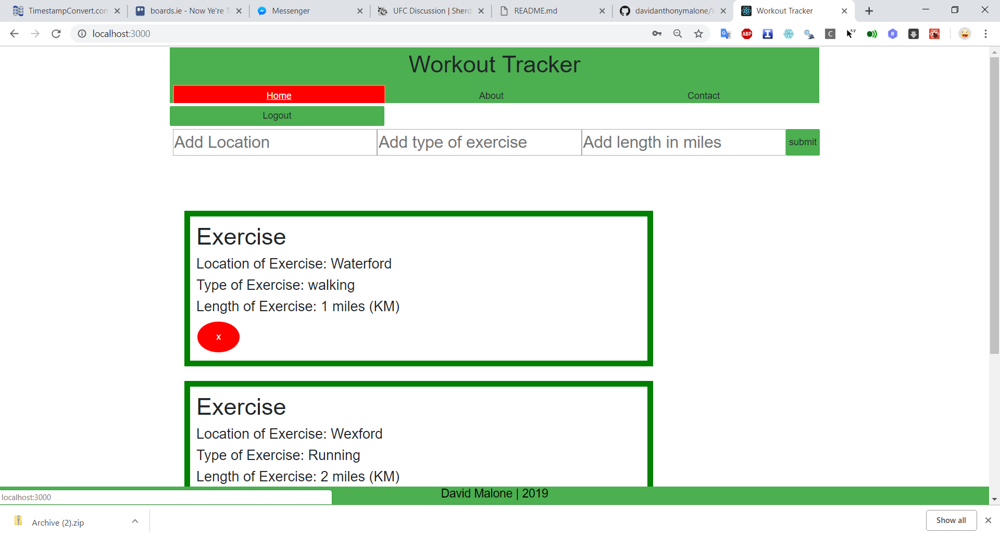
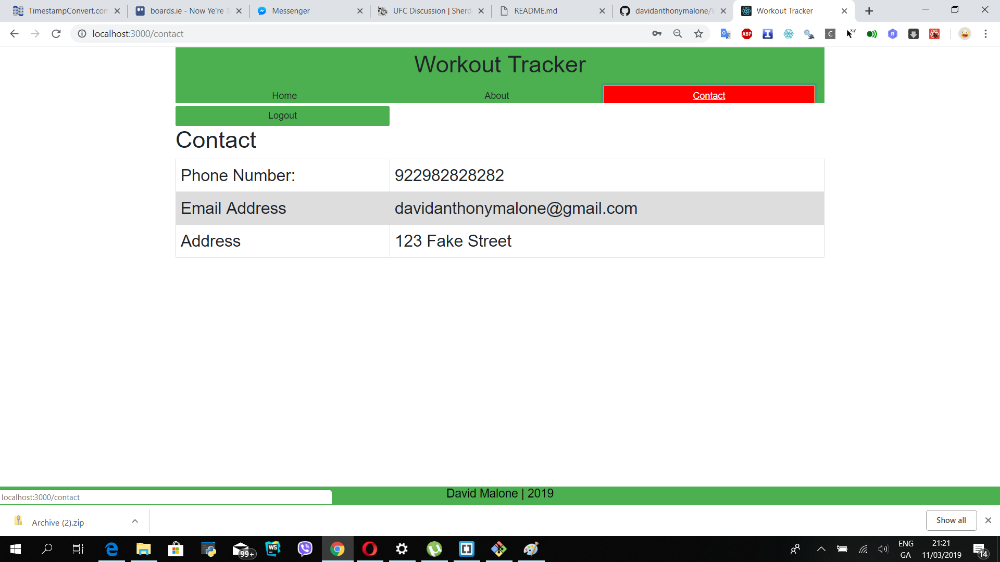
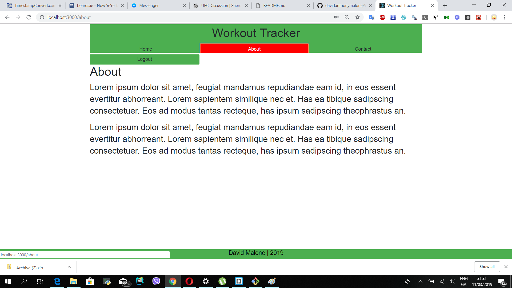

## Authors

@David Malone
@Student Number 20050617
davidanthonymalone@gmail.com if you have any questions.

# Workout Tracker Overview

I have my React application hooked up to Mongo using basic Mongoose modelling.  I have basic read/write and delete functionality working with a Mongo Database. 

Git clone EnterpriseWebDevAssignment2 and then install WorkoutTrackerWithReactJS inside the base folder.

This application has node intergration with Read/Write and delete functionality. The applicaiton also reads, writes and deletes from MongoDB.  

## Data Model Design.
I have one data model and its a fairly simplistic workout data model.

 {
                "id": 1,
                "location": "Waterford",
                "type": "walking",
                "length": "1 miles"
 }

## Description

This application is built with React and it allows users to signup and login using their google accounts and to add exercises.  There is no persistence in this application at this time.  The exercises stub exercises are being fed in from a JSON file using a get method from a JSON file on my github (this is done using a npm package called axious.)

The application is styled partly using bootstrap and partly with custom css.

I have my React application hooked up to Mongo using basic Mongoose modelling.  I have basic read/write and delete functionality working with a Mongo Database. 

## Installation
To get this application working properly with WorkoutReact application you need to clone this application and then clone WorkoutReact application inside the base folder of this application.  Then you need to do an npm start in the base folder of EnterpriseWebDevAssignment2 (starts the server) and then an npm start inside WorkoutTrackerWithReactJS  (starts the application).  Once both applications are started then everything should run properly.

I was experiencing some issues when ignoring the node modules and doing an npm install, for some reason the app would stop working.... so I have included the node modules within the git repo to make sure everything is working when you try test it.

### Dependencies

In the making of this application I used Firebases API for google sign in and Heroku for cloud deployment.

## UI Design.
<h3>Login and Signup Page</h3>

This is the signup and login which is created using Firebase Authentication.  The rest of the pagese can not be viewed unless you login first.  To sign up simply enter an email address and password and press the sign up button and then login.

<h3>Home Page</h3>

This page displays all the workouts that the user has from a placeholder json file.  The user can add a new workout and delete a workout.  There is no persistence and all the data is only session based, once the page is reloaded so is the data.

<h3>Contact Page</h3>

This is where you can contact the app owner about any potential problems

<h3>About Page</h3>

This is the about me page for the app owners.

## Routing
/Login
/Home
/Contact
/About

All routes require you to be logged in first.

